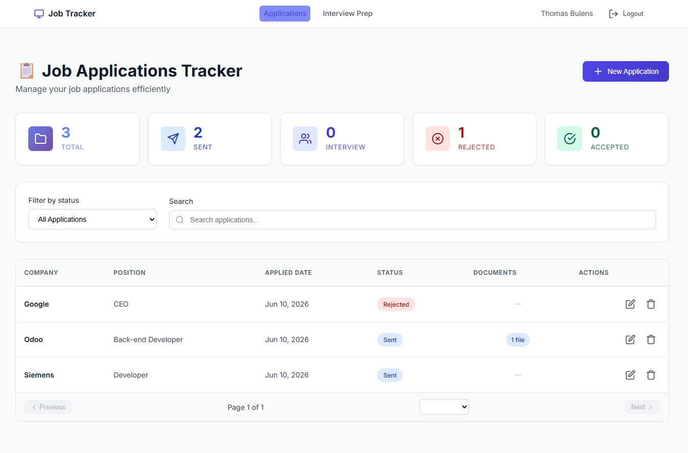
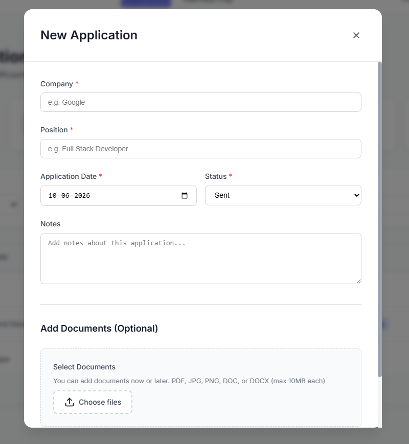
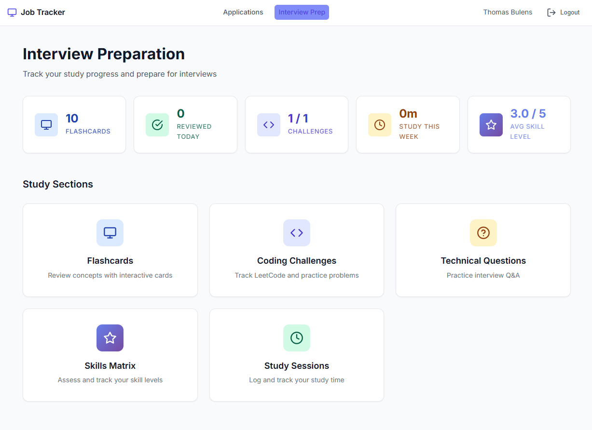
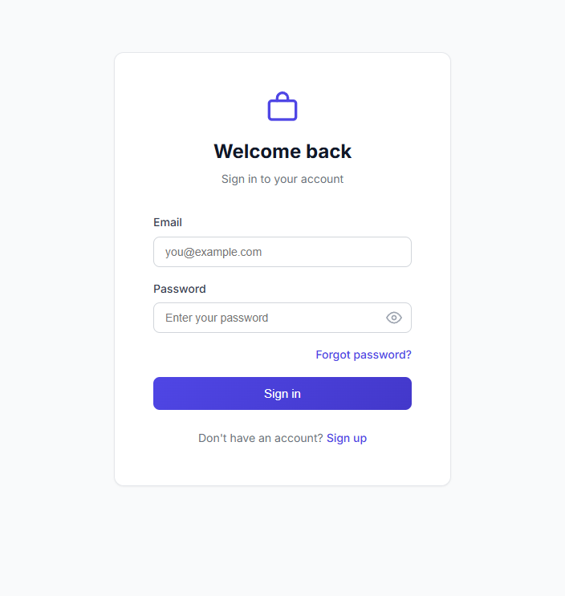

# Job Application Tracker

A full-stack web application to manage your job search and prepare for technical interviews. Track applications through their lifecycle, attach documents, monitor status history, and use built-in study tools to get ready for interviews.

## Screenshots

| Dashboard | New Application |
|---|---|
|  |  |

| Interview Prep | Sign In |
|---|---|
|  |  |

## Features

### Job Application Management
- Create, edit, and delete job applications
- Filter and sort by status, company, date
- Status workflow: Applied → Interview → Offer → Accepted / Rejected
- Status history timeline with audit trail
- Attach documents (CV, cover letter) per application — upload, download, delete

### Authentication
- Register with email verification
- Login with JWT access + refresh token rotation
- Forgot password / reset password via email link
- Route protection with auth guards

### Interview Prep Suite
- **Flashcards** — create Q&A cards, track confidence level and review count
- **Coding Challenges** — log problems with difficulty, solution and status
- **Technical Questions** — categorized Q&A for interview preparation
- **Skills** — track technologies with proficiency level and years of experience
- **Study Sessions** — log study time, topics covered and notes
- **Dashboard** — aggregated stats across all prep activities

## Tech Stack

| Layer | Technology |
|---|---|
| Frontend | Angular 21, TypeScript 5.9, Angular Signals |
| Backend | Spring Boot 4.0, Java 25, Spring Security |
| Database | MySQL 8 |
| Auth | JWT (access + refresh tokens), Spring Security |
| Email | Spring Mail + Gmail SMTP |
| Build | Angular CLI, Maven |

## Architecture

```
job-application-tracker/
├── frontend/          # Angular SPA
│   └── src/app/
│       ├── components/    # UI components (standalone)
│       ├── services/      # HTTP + state services
│       ├── models/        # TypeScript interfaces
│       ├── guards/        # Route protection
│       ├── interceptors/  # JWT injection
│       └── enums/         # Status enums with labels
└── backend/           # Spring Boot REST API
    └── src/main/java/
        ├── controller/    # REST endpoints
        ├── service/       # Business logic (interface + impl)
        ├── repository/    # Spring Data JPA
        ├── model/         # JPA entities
        ├── dto/           # Request/response DTOs
        ├── config/        # Security, JWT filter
        └── exception/     # Global error handling
```

## Prerequisites

- **Java 25** (or adjust `<java.version>` in `backend/pom.xml`)
- **Node.js 20+** and **npm 11+**
- **MySQL 8+**
- **Maven 3.9+**

## Getting Started

### 1. Clone the repository

```bash
git clone https://github.com/thomasbu/job-application-tracker.git
cd job-application-tracker
```

### 2. Set up the database

```sql
CREATE DATABASE job_tracker CHARACTER SET utf8mb4 COLLATE utf8mb4_unicode_ci;
CREATE USER 'tracker_user'@'localhost' IDENTIFIED BY 'tracker_pass';
GRANT ALL PRIVILEGES ON job_tracker.* TO 'tracker_user'@'localhost';
FLUSH PRIVILEGES;
```

Hibernate will create tables automatically on first run (`ddl-auto=update`).

### 3. Configure environment variables

Create a `.env` file in the project root (never committed):

```env
JWT_SECRET=your_long_random_secret_at_least_256_bits
JWT_EXPIRATION=3600000

MAIL_USERNAME=your_gmail_address@gmail.com
MAIL_PASSWORD=your_gmail_app_password

FRONTEND_URL=http://localhost:4200
```

> For Gmail, generate an **App Password** at myaccount.google.com/apppasswords (requires 2FA enabled).

Then load those variables before starting the backend:

```bash
# Windows PowerShell
Get-Content .env | ForEach-Object { $key, $val = $_ -split '=', 2; [System.Environment]::SetEnvironmentVariable($key, $val) }

# Linux/macOS
export $(cat .env | xargs)
```

### 4. Start the backend

```bash
cd backend
.\run-dev.bat                 # Windows (loads .env automatically)
./mvnw spring-boot:run        # Linux/macOS (load .env manually first)
```

API available at `http://localhost:8080`

### 5. Start the frontend

```bash
cd frontend
npm install
npm start
```

App available at `http://localhost:4200`

## Running Tests

```bash
# Backend (17 unit tests)
cd backend
.\mvnw.cmd test           # Windows
./mvnw test               # Linux/macOS

# Frontend (16 unit tests)
cd frontend
npm test -- --run
```

## API Overview

```
POST   /api/auth/register
POST   /api/auth/login
POST   /api/auth/refresh
POST   /api/auth/logout
POST   /api/auth/forgot-password
POST   /api/auth/reset-password
GET    /api/auth/confirm?token=...

GET    /api/applications
POST   /api/applications
GET    /api/applications/{id}
PUT    /api/applications/{id}
DELETE /api/applications/{id}

POST   /api/applications/{id}/document
GET    /api/applications/{id}/document
DELETE /api/applications/{id}/document

GET    /api/flashcards
POST   /api/flashcards
PUT    /api/flashcards/{id}
DELETE /api/flashcards/{id}

GET    /api/coding-challenges
POST   /api/coding-challenges
PUT    /api/coding-challenges/{id}
DELETE /api/coding-challenges/{id}

GET    /api/technical-questions
GET    /api/skills
GET    /api/study-sessions
GET    /api/interview-prep/stats
```

## Key Design Decisions

- **Angular Signals** for reactive state — no NgRx, no RxJS Subject chains
- **Service-layer caching** with 30s TTL to reduce unnecessary HTTP calls
- **Interface-based services** on the backend for testability and clean separation
- **DTOs at API boundaries** — entities never exposed directly
- **Centralized exception handling** via `@ControllerAdvice` with structured error responses
- **Refresh token rotation** — access tokens are short-lived, refresh tokens invalidated on logout
